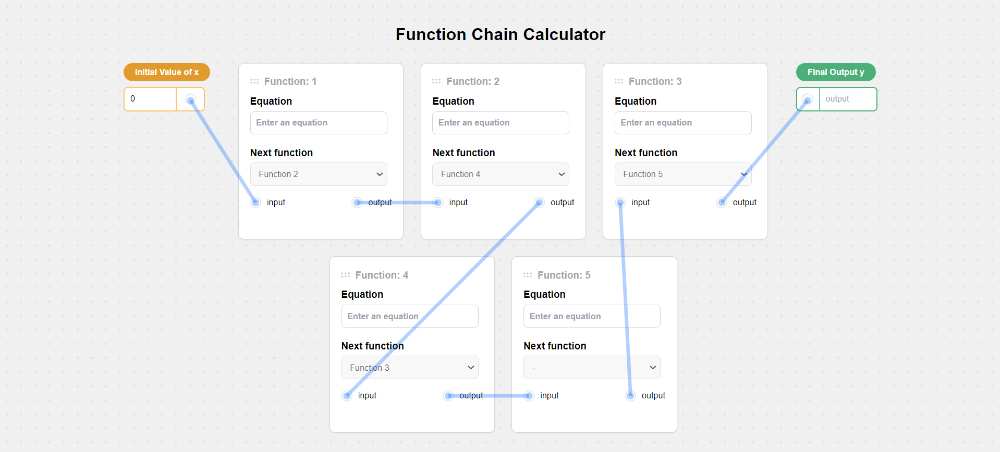
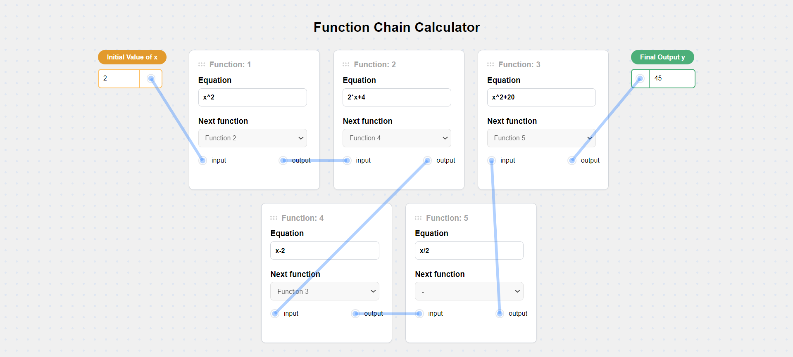

# Function-Card-Calculator
A web application that enables users to input and evaluate mathematical expressions through interactive function cards.

## Features

- **Interactive Function Cards**: Edit, and evaluate mathematical expressions using function cards.
- **Chaining Functions**: Chain your functions together to form complex expressions (This is fixed right now, but can be upgraded).
- **Real-time Evaluation**: Get instant feedback as you input and modify expressions.

## Screenshots

### Home Page


### Real-time Evaluation


## Installation

1. Clone the repository:
    ```sh`
    git clone https://github.com/km0401/Function-Card-Calculator.git
    ```
2. Navigate to the project directory:
    ```sh
    cd function-chain-calculator
    ```
3. Install dependencies:
    ```sh
    npm install
    ```

## Usage

1. Start the development server:
    ```sh
    npm start
    ```
2. Open your browser and navigate to `http://localhost:3000`.

## Contributing

1. Fork the repository.
2. Create a new branch:
    ```sh
    git checkout -b feature-branch
    ```
3. Make your changes and commit them:
    ```sh
    git commit -m "Add new feature"
    ```
4. Push to the branch:
    ```sh
    git push origin feature-branch
    ```
5. Open a pull request.
